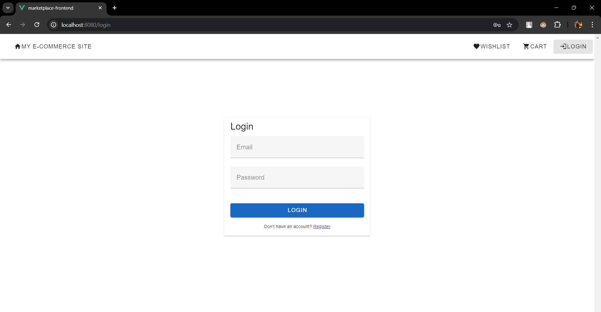
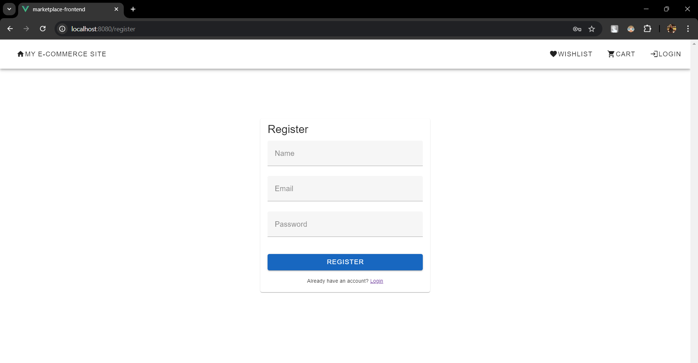
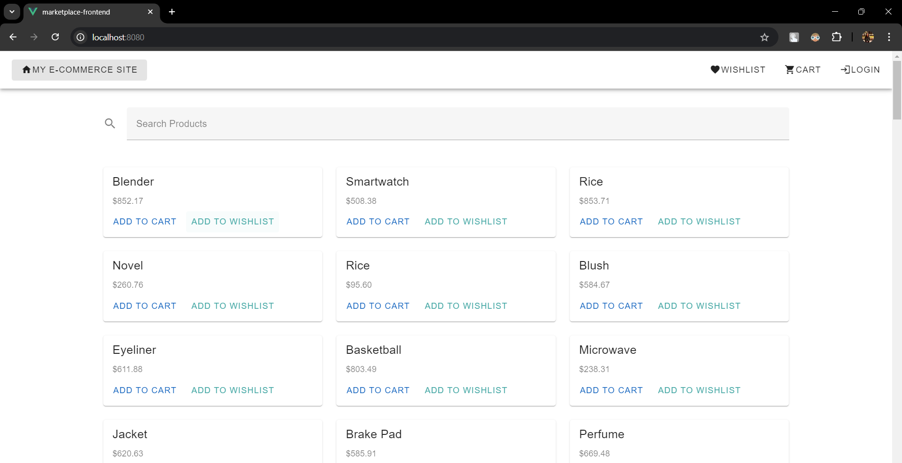
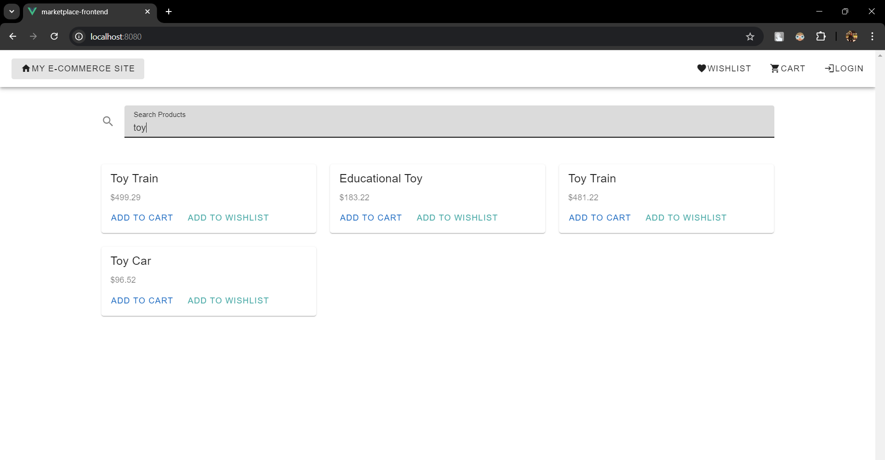
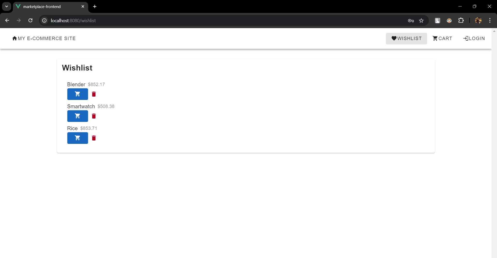
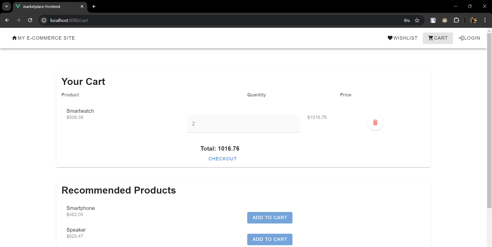
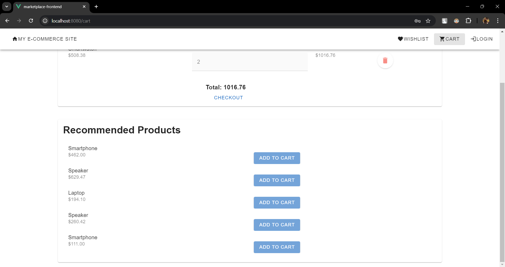
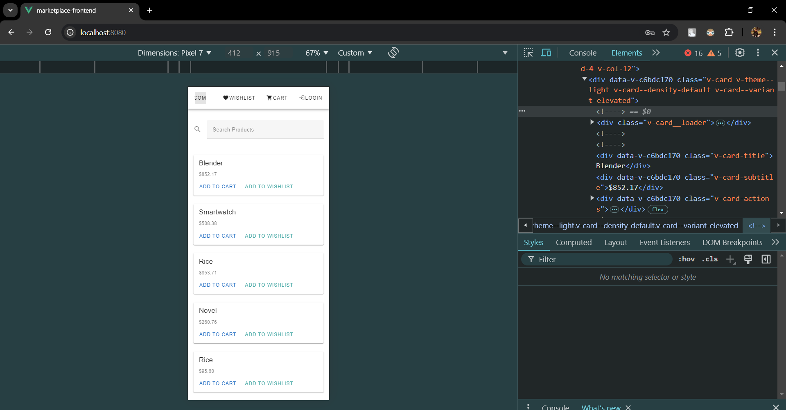
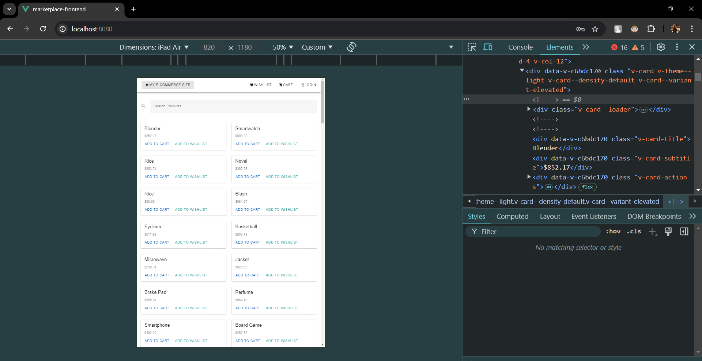

# Full-Stack Developer Assignment

This project involves three main components: frontend development with Vue.js, backend development with Laravel PHP, and machine learning integration for product recommendation and category prediction.

## Screenshots

### Login


### Register


### Home


### Search


### Wishlist


### Cart


### Product Suggestions


### Responsive Design

#### Phone (Pixel)


#### Tablet (iPad Air)


## Part 1: Frontend Development (Vue.js)

### Task
Create a web application for a product marketplace.

### Requirements
- Use Vue.js for the frontend.
- Implement a search bar with real-time filtering of products.
- Add user authentication (login/register) using JWT tokens.
- Allow authenticated users to add products to their wishlist.
- Implement shopping cart functionality with the ability to add/remove products.
- Use a design system or UI component library (e.g., Vuetify).
- Ensure the application is fully responsive and adheres to modern UX/UI standards.

## Part 2: Backend Development (Laravel PHP)

### Task
Develop a comprehensive API to manage the marketplace functionalities.

### Requirements
- Use Laravel to build the backend API.
- Implement user authentication with JWT tokens.
- Provide endpoints for product management using JSON (CRUD operations).
- Implement wishlist functionality for authenticated users.
- Create endpoints for managing the shopping cart (add/remove products, checkout).
- Implement authentication and authorization.
- Use MySQL for DB storage and retrieval.

## Part 3: Machine Learning Integration

### Task
Integrate an advanced ML model for product recommendation and category prediction.

### Requirements
- Train or use a pre-trained ML model for product recommendations (collaborative filtering or content-based filtering).
- Train or use a pre-trained ML model to predict product categories based on descriptions.
- Create endpoints in Laravel to handle product recommendations and category predictions.
- Ensure scalability and performance of the ML integration.

### ML Model for Product Recommendation

1. **Model Training**:
   - Use or train a model with collaborative filtering or content-based filtering techniques.
   - Utilize historical user behavior data for training.

2. **Model Deployment**:
   - Save the trained model and integrate it into the Laravel backend.
   - Create an endpoint in Laravel to serve product recommendations based on user data.

3. **Category Prediction**:
   - Use or train a model to predict product categories based on descriptions.
   - Integrate the model into the Laravel backend and create an endpoint for category predictions.

## Setup and Running the Application

### Prerequisites
- Node.js
- NPM/Yarn
- PHP
- Composer
- MySQL
- Python (for ML models)

### Frontend Setup

1. **Navigate to the frontend directory**:
   ```bash
   cd marketplace-frontend
   ```

2. **Install dependencies**:
   ```bash
   npm install
   # or
   yarn install
   ```

3. **Run the frontend application**:
   ```bash
   npm run serve
   # or
   yarn serve
   ```

### Backend Setup

1. **Navigate to the backend directory**:
   ```bash
   cd marketplace-backend
   ```

2. **Install PHP dependencies**:
   ```bash
   composer install
   ```

3. **Configure the environment**:
   - Copy `.env.example` to `.env` and configure your database and other settings.

4. **Run migrations and seed the database**:
   ```bash
   php artisan migrate
   php artisan db:seed
   ```

5. **Run the backend application**:
   ```bash
   php artisan serve
   ```

### Machine Learning Setup

1. **Install Python dependencies**:
   ```bash
   pip install -r requirements.txt
   ```

2. **Train or load the ML models**:
   - Follow the specific instructions provided with the model to train or load it.

3. **Integrate ML models with the Laravel backend**:
   - Ensure the model is accessible via API endpoints.

## Notes

- Ensure that both the frontend and backend applications are running simultaneously for full functionality.
```
